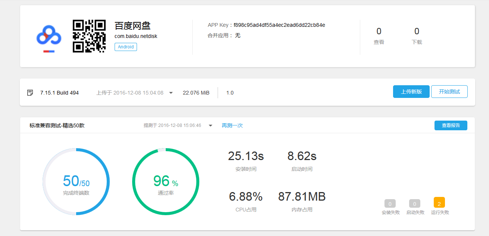
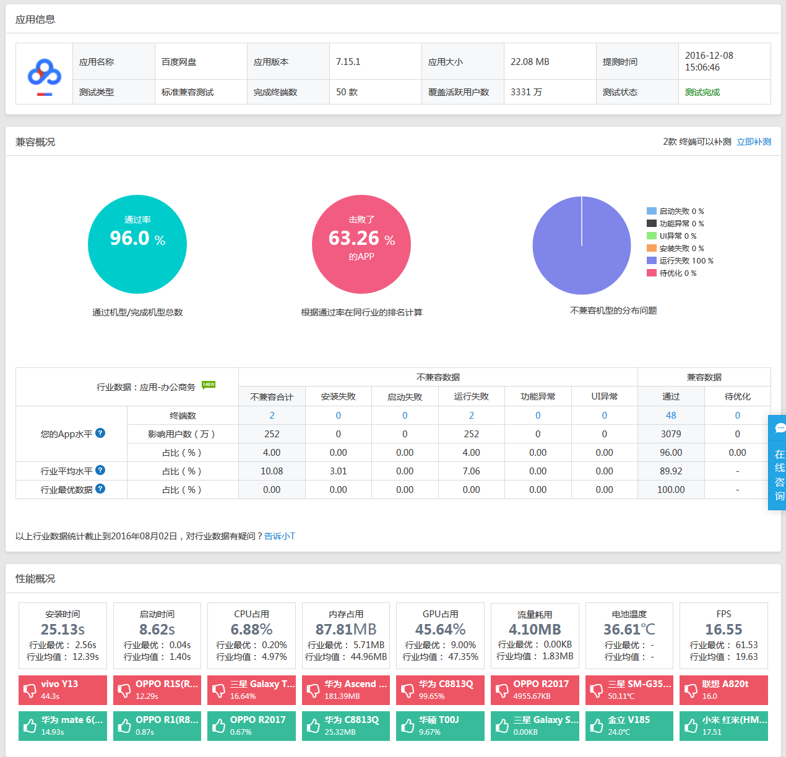
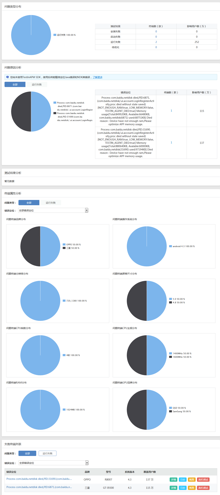
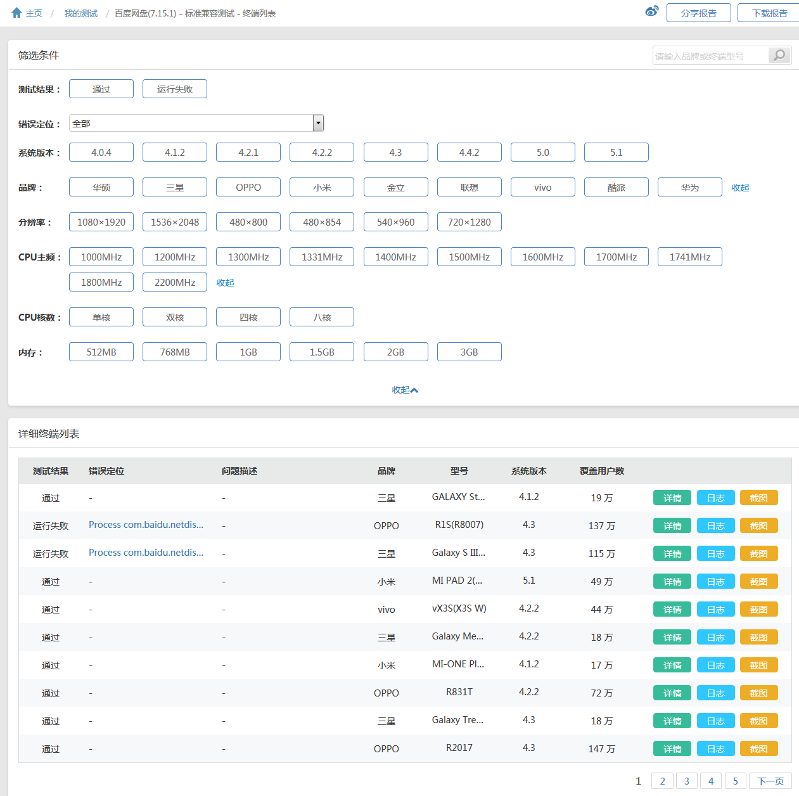

***
###testin 网站的介绍
- testin 网站是一个做 APP 测试的网站，测试很全面。支持内测分发，功能测试，兼容测试，崩溃测试和 A/B 测试，还有自己的 APP 自动化测试应用 iTestin。
网站所面向的用户包括个人和企业两种。属于盈利网站，但是有一定得优惠服务。

- 网站地址为：[http://www.testin.cn/](http://www.testin.cn/)

***
###进行测试
- 将百度网盘的安卓版 APP 上传并进行了标准兼容测试，精选 50 款手机。

***
###使用体验
- 刚刚使用不久，了解不全面，觉得这个网站还是很好的，虽然每天只能免费使用一次，而且免费使用的服务也是有限的，不是所有的服务都可以免费使用。

- 有一点想说的就是觉得这个网站的界面用起来不是很方便，没有一目了然的感觉，总是觉得不知道该点哪里去找想打开的东西。

- 服务质量挺好的，尤其满意的地方是手机款式很全。

***
###测试结果分析报告
请点击[这里](测试结果分析.txt)查看。

***
###测试结果如下：

####概况

 
 
####详情

***

***
 
